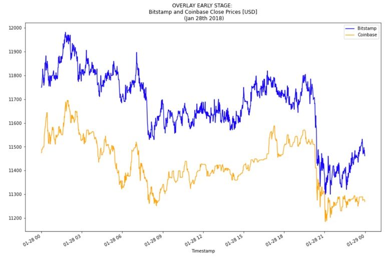
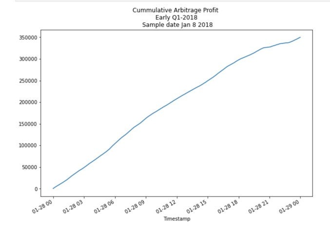

# Bitcoin Arbitrage

Does the bitcoin market presents profitable opportunities for arbitrage? If it does, how profitable they can be?

The present project analizes those questions based on the big crush of Q1 2018, when the bitcoin price fell by 65% in a month period. The analysis compares buying/selling on two major exchanges, which are Bitstamp and Coinbase.

This project quantifies profits on a good day in early, middle and late parts of the period, considering transaction costs. The analisis is replicable for other periods, and it concludes that at the early stage there were potential for large profits. Also, that the opportunity for high profits vanishes fastly, so in order to profit, being able to act fast is key.

---

## Technologies

The analysis is made on Jupyter Lab, and it uses Pandas for quantitative analysis, pathlib for csv data inputs, and Matplotlib for visualizations.

---

## Installation Guide

The analysis is made on a Jupyter Notebook, that you can open and run in Jupyter Lab. For references to the installation of Jupyter Lab, you can check this link:
https://jupyter.org/install

---

## Examples

The analysis based profits on the differences in price on good days selected from three different stages: early, middle and late, meaning a day in January, another in February, and a third one in March 2018.

Below is an example of difference in prices between Bitstamp and Coinbase in a good day for arbitrage, whic is Jan 28th 2018 

We calculated returns per trade, and selected only profitable trades above transaction cost of 1% using a proper boolean filter. The total profit were calculated as the sum of all profitable trades on the day using `cumsum`function. 

---

## Usage

The code is pre-run. If you want to update dates, you can do so for new visualizations, by changing dates on the series and run the code again. Changing dates will update calculations and visualizations in the code, including summary statistics. However, it will not update the text with the analysis and conclusions.

---

## Contributors

This project was coded by Paola Carvajal Almeida, paola.antonieta@gmail.com.

Contact email: paola.antonieta@gmail.com
LinkedIn profile: https://www.linkedin.com/in/paolacarvajal/

---

## License

This project uses a MIT license. This license allows you to use the licensed material at your discretion, as long as the original copyright and license are included in your work files. This license does not contain a patent grant,  and liberate the authors of any liability from the use of this code.

